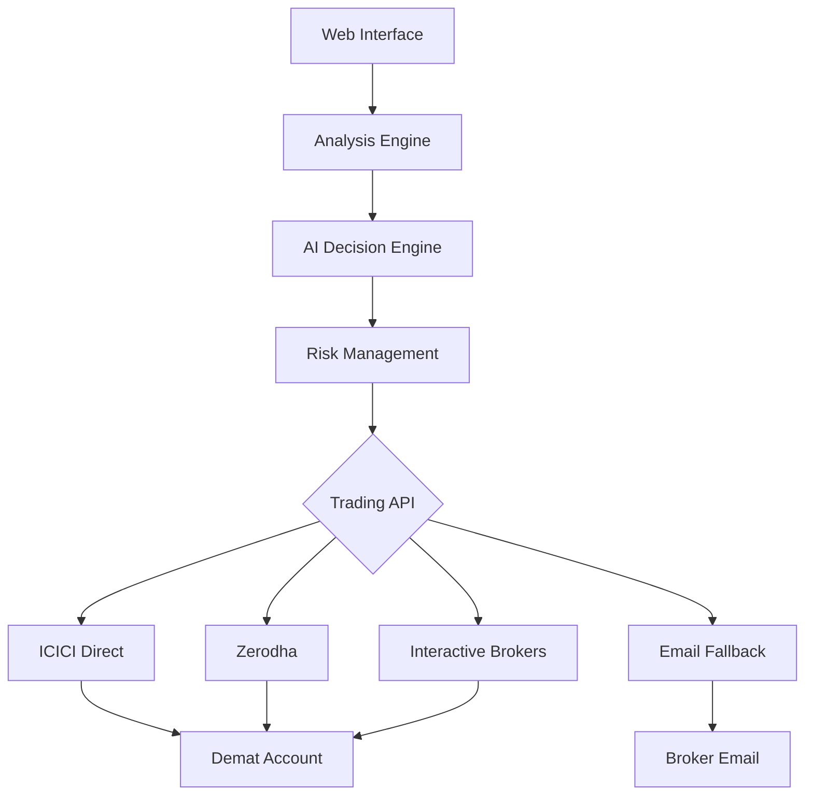

# Financial Market Analysis System

A comprehensive AI-powered financial market analysis system that combines FinBERT sentiment analysis, historical data analysis, and Google Gemini AI to make intelligent trading recommendations. Features a modern web interface with portfolio management, user authentication, and automated scheduling.

## 🚀 Features

### 🤖 **AI-Powered Analysis**
- FinBERT-based sentiment analysis from multiple news sources
- Historical price data analysis with 15+ technical indicators
- Google Gemini AI for intelligent trading decisions
- Portfolio-aware recommendations with position sizing

### 🌐 **Modern Web Interface**
- Responsive web application with Bootstrap UI
- User authentication and profile management
- Real-time portfolio tracking and management
- Interactive analysis dashboard
- Automated scheduling system

### 📊 **Portfolio Management**
- Multi-portfolio support with holdings tracking
- Real-time price updates and P&L calculations
- Transaction history and performance analytics
- Asset allocation and diversification insights
- Portfolio-aware AI recommendations

### 📧 **Automated Communication**
- Professional email generation for broker communication
- Order-focused email content (client placing trades)
- Portfolio context integration in recommendations
- Automated scheduling with email notifications

### 🎯 **Trading Recommendations**
- BUY/SELL/HOLD decisions with confidence levels
- Position sizing recommendations (SMALL/MEDIUM/LARGE)
- Risk assessment and stop-loss suggestions
- Target price calculations
- Sell recommendations for portfolio rebalancing

## 🏗️ System Architecture

### Web Application Stack
- **Backend**: Flask with SQLAlchemy ORM
- **Frontend**: Bootstrap 5 with vanilla JavaScript
- **Database**: SQLite (development) / PostgreSQL (production)
- **Authentication**: Flask-Login with bcrypt
- **Security**: CSRF protection with Flask-WTF

### Analysis Pipeline
1. **NLP Sentiment Analysis** - FinBERT model for financial sentiment
2. **Historical Data Analysis** - Technical indicators and trend analysis
3. **AI Decision Making** - Google Gemini AI for trading recommendations
4. **Portfolio Integration** - Context-aware recommendations
5. **Communication** - Professional broker emails

## 📋 Supported Assets

### Commodities (15)
**Precious Metals:** Gold, Silver, Platinum, Palladium  
**Energy:** Crude Oil, Natural Gas  
**Industrial Metals:** Copper, Aluminum, Zinc  
**Agricultural:** Wheat, Corn, Soybeans, Coffee, Sugar, Cotton

### Stocks (59)
Major stocks including Apple, Microsoft, Google, Amazon, Tesla, and more.

## 🛠️ Installation

### Prerequisites
- Python 3.8 or higher
- pip package manager
- Internet connection for data fetching

### Quick Start

1. **Clone the repository**
   ```bash
   git clone https://github.com/uscool/stock-prediction-system.git
   cd stock-prediction-system
   ```

2. **Install dependencies**
   ```bash
   pip install -r requirements.txt
   ```

3. **Configure environment variables**
   ```bash
   cp .env.example .env
   # Edit .env with your API keys and email configuration
   ```

4. **Initialize the database**
   ```bash
   python setup_database.py
   ```

5. **Run the application**
   ```bash
   python web_app.py
   ```

6. **Access the web interface**
   - Open your browser to `http://localhost:5000`
   - Register a new account or login
   - Start analyzing markets and managing portfolios

### Required Configuration

Edit the `.env` file with your credentials:

```env
# Required - Get from Google AI Studio
GEMINI_API_KEY=your_gemini_api_key_here

# Required - Email configuration for broker communication
SMTP_SERVER=smtp.gmail.com
SMTP_PORT=587
EMAIL_ADDRESS=your_email@gmail.com
EMAIL_PASSWORD=your_app_password
BROKER_EMAIL=broker@bank.com

# Optional - Additional data sources
ALPHA_VANTAGE_API_KEY=your_alpha_vantage_key_here
NEWSAPI_KEY=your_newsapi_key_here

# Application Configuration
SECRET_KEY=your_secret_key_here
DATABASE_URL=sqlite:///instance/financial_analyzer.db
```

## 🎮 Usage

### Web Interface

1. **Register/Login** - Create an account to access all features
2. **Create Portfolio** - Set up your investment portfolios
3. **Add Holdings** - Track your current positions
4. **Run Analysis** - Analyze individual assets or entire portfolios
5. **Schedule Analysis** - Set up automated daily/weekly analysis
6. **View Recommendations** - Get AI-powered trading suggestions

### Command Line Interface

**Analyze a single asset:**
```bash
python main.py --commodity gold --timeframe 30 --email
```

**Analyze multiple assets:**
```bash
python main.py --commodities gold silver crude_oil --timeframe 14 --summary-email
```

**List available assets:**
```bash
python main.py --list-commodities
```

## 🔄 Trading Integration

### Current Implementation: Email-Based Trading

The system currently executes trades via **professional email communication** to brokers. This approach:

- **Avoids Legal Issues**: No direct access to user's demat accounts
- **Professional Communication**: Generates order-ready emails for brokers
- **Portfolio Context**: Includes current holdings and rebalancing recommendations
- **Compliance**: Maintains proper audit trail through email records

### Production Trading API Integration

In a production environment, the system would integrate with trading APIs such as:

#### **ICICI Direct Breeze SDK**
```python
# Example integration (not implemented)
from breeze_connect import BreezeConnect

def execute_trade(symbol, action, quantity, price):
    breeze = BreezeConnect(api_key="your_api_key")
    breeze.generate_session(api_secret="your_secret", 
                           session_token="your_token")
    
    order = breeze.place_order(
        stock_code=symbol,
        exchange_code="NSE",
        product="cash",
        action=action,  # "buy" or "sell"
        order_type="market",
        quantity=quantity,
        price=price
    )
    return order
```

#### **Other Trading APIs**
- **Zerodha Kite Connect** - Popular Indian broker API
- **Interactive Brokers TWS API** - Global trading platform
- **Alpaca Trading API** - US-based commission-free trading
- **TD Ameritrade API** - US broker with comprehensive API

### Production Architecture



### Risk Management Features

- **Position Sizing**: AI-recommended position sizes based on portfolio value
- **Stop Loss**: Automatic stop-loss calculations
- **Diversification**: Portfolio rebalancing recommendations
- **Risk Assessment**: Multi-factor risk scoring
- **Compliance**: Audit trails and transaction logging

## 📊 Portfolio Management Features

### Portfolio Tracking
- **Multi-Portfolio Support**: Manage multiple investment portfolios
- **Real-Time Prices**: Live price updates for all holdings
- **P&L Calculation**: Real-time profit/loss tracking
- **Performance Analytics**: Historical performance analysis

### AI-Powered Recommendations
- **Portfolio-Aware Decisions**: AI considers existing holdings
- **Rebalancing Suggestions**: Recommendations for portfolio optimization
- **Sell Recommendations**: Specific guidance on which positions to close
- **Risk Management**: Position sizing based on portfolio risk

### Transaction Management
- **Buy/Sell Tracking**: Complete transaction history
- **Cost Basis**: Average cost calculations
- **Tax Reporting**: Transaction data for tax purposes
- **Performance Metrics**: ROI, Sharpe ratio, and other KPIs

## 🔧 API Endpoints

### Authentication
- `POST /register` - User registration
- `POST /login` - User login
- `POST /logout` - User logout
- `GET /api/user/profile` - User profile

### Portfolio Management
- `GET /api/portfolios` - List user portfolios
- `POST /api/portfolios` - Create new portfolio
- `PUT /api/portfolios/<id>` - Update portfolio
- `DELETE /api/portfolios/<id>` - Delete portfolio
- `GET /api/portfolios/<id>/holdings` - Get portfolio holdings
- `POST /api/portfolios/<id>/holdings` - Add holding
- `DELETE /api/portfolios/<id>/holdings/<symbol>` - Remove holding

### Analysis
- `POST /api/analyze` - Analyze single asset
- `POST /api/analyze-multiple` - Analyze multiple assets
- `GET /api/assets` - List available assets
- `GET /api/prices/<symbol>` - Get current price
- `POST /api/prices/batch` - Get multiple prices

### Scheduling
- `GET /api/schedules` - List scheduled analyses
- `POST /api/schedules` - Create new schedule
- `PUT /api/schedules/<id>` - Update schedule
- `DELETE /api/schedules/<id>` - Delete schedule
- `POST /api/schedules/<id>/run` - Run schedule manually

## 🛡️ Security Features

- **User Authentication**: Secure login with bcrypt password hashing
- **CSRF Protection**: Cross-site request forgery protection
- **Session Management**: Secure session handling
- **Input Validation**: Comprehensive input sanitization
- **API Security**: Rate limiting and request validation

## 📈 Performance

- **Concurrent Analysis**: Multiple assets analyzed in parallel
- **Intelligent Caching**: Reduces API calls and improves performance
- **Database Optimization**: Efficient queries with SQLAlchemy
- **Real-Time Updates**: WebSocket support for live data
- **Scalable Architecture**: Ready for production deployment

## 🚨 Important Disclaimers

### Financial Disclaimer
⚠️ **This system is for educational and research purposes only.**

- **Not Financial Advice**: This is not professional financial advice
- **Risk Warning**: All trading involves substantial risk of loss
- **Due Diligence**: Always conduct your own research before making investment decisions
- **No Guarantees**: Past performance does not guarantee future results
- **Professional Consultation**: Consult with qualified financial advisors

### Legal Compliance
- **Regulatory Compliance**: Ensure compliance with local financial regulations
- **API Terms**: Review and comply with trading API terms of service
- **Data Privacy**: Implement proper data protection measures
- **Audit Requirements**: Maintain proper transaction records

## 🔮 Future Enhancements

### Planned Features
- **Mobile App**: React Native mobile application
- **Advanced Analytics**: Machine learning model improvements
- **Social Trading**: Copy trading and social features
- **Options Trading**: Support for options and derivatives
- **Crypto Integration**: Cryptocurrency market analysis
- **Backtesting**: Historical strategy testing
- **Paper Trading**: Risk-free trading simulation

### Technical Improvements
- **Microservices**: Break down into microservices architecture
- **Containerization**: Docker and Kubernetes deployment
- **Monitoring**: Comprehensive logging and monitoring
- **Testing**: Automated testing suite
- **CI/CD**: Continuous integration and deployment

## 🤝 Contributing

We welcome contributions! Please:

1. Fork the repository
2. Create a feature branch
3. Make your changes
4. Add tests if applicable
5. Submit a pull request

### Development Setup
```bash
# Install development dependencies
pip install -r requirements-dev.txt

# Run tests
python -m pytest

# Run linting
flake8 .

# Run type checking
mypy .
```

## 📄 License

This project is provided as-is for educational purposes. Use at your own risk.

## 🙏 Acknowledgments

- **Google Gemini AI** for intelligent trading decisions
- **FinBERT** for financial sentiment analysis
- **Yahoo Finance** for market data
- **Bootstrap** for the modern web interface
- **Flask** for the robust web framework

---

**Built with ❤️ for the financial analysis community**

*For support and questions, please open an issue on GitHub.*